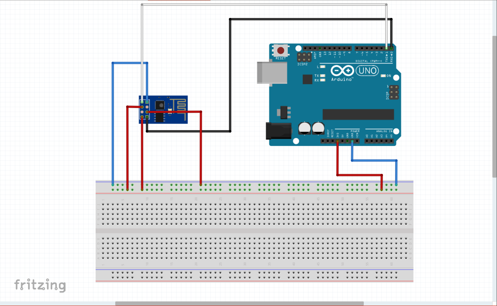

# Daily
Note something

## Arduino ESP8266

折腾了许久的ESP8266终于在今天精通了，网上的许多教程写的太过复杂而且不易于初学者学习，故走了许多弯路  
今天我将如何使用Arduino对ESP8266模块进行烧写程序的步骤整理一下，供初学者学习。  
首先，你要按照我下图所给的方式接线  
  
然后根据网上的教程在板管理器里下载ESP8266相关的库  
你可以自己写程序来验证ESP8266模块是否能正常工作  
也可以用示例程序AdvancedWebServer
当程序写好了之后你就可以点击上传，将程序上传到你的Arduino  
上传完成后Arduino IDE应该会给出如下显示  
  
程序上传完后并不能直接在单片机上运行  
因为ESP8266的设计的问题，在程序下载完后需要先将GPIO0引脚连接一个高电平，然后将RST引脚连接到GND，就是连一下然后拔出来  
这时候打开串口监视器就会出现一串点，等个几秒钟就能看到你程序运行的结果了  
之前网上的好多教程都写了什么用TTL或者把Arduino的单片机扣下来，这些估计都是转载别人的，根本没有实践过，这些步骤都不需要，  
直接按我上图那样接线就行。